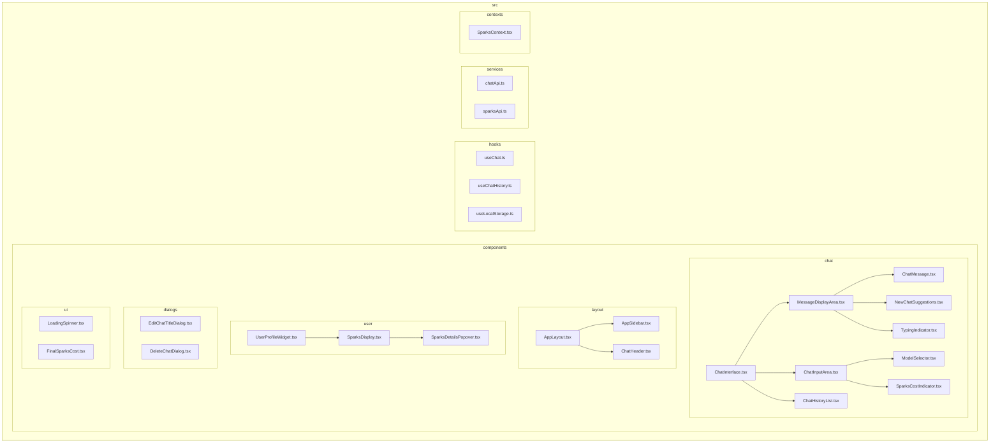

# Frontend Refactoring Plan

This document outlines the plan for refactoring the frontend components to improve modularity, decouple business logic, and prepare for future features like "Tavern".

### High-Level Goals

1.  **Decouple Business Logic from UI**: Extract complex logic from large components (especially `ChatInterface.tsx`) into custom hooks. This makes components leaner and easier to understand, and the logic becomes reusable.
2.  **Improve Component Cohesion**: Break down large components that do too many things into smaller, more focused components with a single responsibility.
3.  **Establish a Scalable Structure**: Reorganize the `src` directory to better separate concerns (e.g., `hooks`, `services`, and different categories of components), making it easier to add new features like "Tavern" without cluttering the existing codebase.

### Proposed New Structure

Here's a Mermaid diagram illustrating the proposed new directory and component structure. This aims to separate chat-specific components from reusable UI, layout, and user-related components.

### Phased Refactoring Plan

We will tackle this in three phases:

**Phase 1: Core Logic Extraction (The Biggest Win)**

The main goal here is to untangle `ChatInterface.tsx`.

1.  **Create `src/hooks` directory.**
2.  **Create a `useChat` hook**: This hook will manage the core state and logic for a chat session (messages, loading states, sending messages, handling streaming responses). This will significantly simplify `ChatInterface.tsx`.
3.  **Create a `useLocalStorage` hook**: A small, reusable hook to manage persisting data like the user's favorite model, cleaning up `ChatInterface.tsx` further.
4.  **Refactor `ChatInterface.tsx`**: It will become a much simpler "container" component that uses the `useChat` hook and assembles the UI.

**Phase 2: Component Decomposition & Reorganization**

We'll break down components that are doing too much.

1.  **`ChatHeader.tsx`**: Extract the Edit and Delete modals into their own components: `EditChatTitleDialog.tsx` and `DeleteChatDialog.tsx` inside `src/components/dialogs/`.
2.  **`ChatHistorySidebar.tsx`**: This component has layout, user, and chat-history concerns. We'll split it into:
    - `AppSidebar.tsx` (in `src/components/layout/`)
    - `ChatHistoryList.tsx` (in `src/components/chat/`)
    - `UserProfileWidget.tsx` (in `src/components/user/`)
3.  **`MessageDisplayArea.tsx`**: The "Welcome/Suggestion" screen for a new chat will be extracted into a `NewChatSuggestions.tsx` component.
4.  **`SparksDisplay.tsx`**: The complex popover will be extracted into `SparksDetailsPopover.tsx` to keep the main display component lean.

**Phase 3: Service Layer Abstraction**

To make our code even cleaner and prepare for future API needs (like for the "Tavern").

1.  **Create `src/services` directory.**
2.  **Create `chatApi.ts`**: All `fetch` calls related to the `/api/chat/*` endpoints will be moved here. The `useChat` hook will use this service, abstracting away the raw `fetch` calls.
3.  **Create `sparksApi.ts`**: Similarly, logic for fetching sparks balance and claiming rewards will move here.
